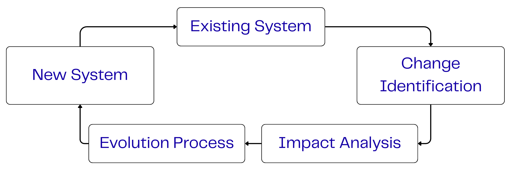

<center>

# SWE-EVO: A Frontier Benchmark for Coding Agents in Autonomous Software Evolution

</center>

[](LICENSE)
[](https://www.python.org/downloads/)
[](https://github.com/FSoft-AI4Code/SWE-EVO/issues)
[](https://github.com/FSoft-AI4Code/SWE-EVO/stargazers)


## Overview

SWE-EVO is a benchmark designed to evaluate AI coding agents in autonomous software evolution tasks. Unlike benchmarks that focus on isolated coding problems, SWE-EVO simulates realistic scenarios in which agents must iteratively evolve complex codebases according to high-level software requirement specifications (SRS).

Using versioned histories from real Python open-source projects (such as Django and NumPy), SWE-EVO challenges agents to:

- Interpret high-level SRS.
- Plan and implement multi-step changes.
- Navigate large-scale repositories with thousands of files.
- Produce correct changes across multiple versions.

The benchmark addresses the key research question:  
*Given an existing codebase and evolving requirements, can AI agents autonomously perform sustained planning, adaptation, and evolution over long interactions?*

**Paper**: [SWE-EVO: A Frontier Benchmark for Coding Agents in Autonomous Software Evolution](https://arxiv.org/abs/XXXX.XXXXX)

## Key Features

- **Realistic Tasks**: Derived from authentic project evolution histories, emphasizing change over time.
- **Multi-Step Evaluation**: Agents must plan, update, and validate changes across versions.
- **Modular Scaffold Support**: Currently supports evaluation via two scaffolds: **OpenHands** and **SWE-agent**.
- **Public Dataset**: Includes curated instances with tools for reproducible evaluation.
- **Benchmark Focus**: Long-horizon reasoning and iterative evolution challenges for AI systems.

  
*Conceptual model of software evolution in SWE-EVO, depicting the cycle from a base system to an evolved system through requirement interpretation and change execution.*

## Setup

Ensure you have:

- Python 3.10 or above
- Install project dependencies:

```bash
pip install -e .
````

## Evaluation

To evaluate a set of trajectories:

```bash
python SWE-bench/evaluate_instance.py \
  --trajectories_path <path-to-your-trajectories> \
  --max_workers <num_workers> \
  --scaffold <scaffold_name>
```

### Example

Using the **OpenHands** scaffold:

```bash
python SWE-bench/evaluate_instance.py \
  --trajectories_path /workspace/tue/swe_world_2/OpenHands/evaluation/evaluation_outputs/outputs/__mnt__data__swe_world_2__SWE-EVO__hf_out__hf_jsonl-test/CodeActAgent/gpt-5-2025-08-07_maxiter_100_N_v0.58.0-no-hint-run_1 \
  --max_workers 8 \
  --scaffold OpenHands
```

## Acknowledgements

SWE-EVO builds on the original [SWE-bench](https://www.swebench.com/) benchmark, and we are grateful to the SWE-bench team for their foundational work in software engineering evaluation.

## License

This project is released under the MIT License. See `LICENSE` for details.


